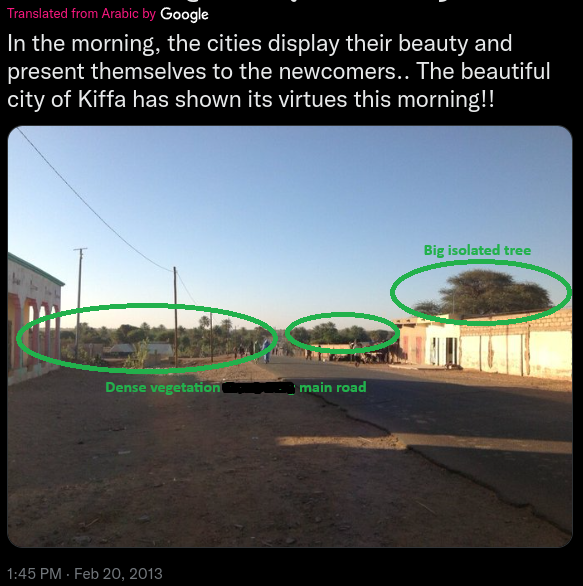

# (OSINT EX 001)Investigation-MAIN

# PHOTO 1 REPORT

**Task briefing:**
Below you can see a screenshot from a tweet containing a photo. It contains all the relevant information necessary to help you find the exact location. 
Please identify the coordinates of where the photo was taken.

***

## Content Analysis -

### Text Content:

| Extracted Text       | "In the morning, the cities display their beauty and present themselves to the newcomers.. The beautiful city of Kiffa has shown its virtues this morning!!" | A morning in Kiffa, Mauritania. Time and date cannot be confirmed from text alone. Not original media. Post date/time does not match text. | A - Translated from Arabic and local garb corroborate Kiffa. |
| -------------------- | ------------------------------------------------------------------------------------------------------------------------------------------------------------ | ------------------------------------------------------------------------------------------------------------------------------------------ | ------------------------------------------------------------ |
| Tone                 | beauty, beautiful, virtues, (!!!).                                                                                                                           | Proud, happy, representitive of the city                                                                                                   |                                                              |
| OP Information       | Writes in Arabic.                                                                                                                                            |                                                                                                                                            |                                                              |
| Location Information | Kiffa                                                                                                                                                        |                                                                                                                                            | A - Further analysis confirms location                       |
| Threat Information   | None                                                                                                                                                         |                                                                                                                                            |                                                              |
|                      | Content                                                                                                                                                      | Analysis Conclusions                                                                                                                       | Confidence Level                                             |

***

### Image Content:

| Location          | Kiffa, Mauritania                                                                                                          | Extracted from text, cross referenced with google.                                                                                        | A                |
| ----------------- | -------------------------------------------------------------------------------------------------------------------------- | ----------------------------------------------------------------------------------------------------------------------------------------- | ---------------- |
| Time              | Posted 1:45 PM                                                                                                             | Time posted does not seem to reflect time of photo taken.                                                                                 | F                |
| Enviroment        | Arrid, dry, sunny                                                                                                          | Southern Hemisphere - Africa/Middle East                                                                                                  | B                |
| Elements Observed | Main road, util poles, 3 building in foreground, group of structures down road. Vegetation clusters, tree behind building. | Not going to be google street view or in-depth google earth coverage. Secondary images showing alt pov of orgin photo may have headwinds. | A                |
|                   | Analysis Conclusions                                                                                                       | Analysis                                                                                                                                  | Confidence Level |

***

### EXIF Metadata:

| Name        | osintexercise001.png         |
| ----------- | ---------------------------- |
| File Size   |  288 KB (295074 bytes)       |
| File Type   | PNG                          |
| MIME Type   | image/png                    |
| Image Size  | 583 x 586 (0.342 megapixels) |
| Geolocation | Kiffa, Mauritania            |

***

### Geolocation Analysis

|                  |                   | Analysis Conclusions | Confidence Level |
| ---------------- | ----------------- | -------------------- | ---------------- |
| Toponym          | Kiffa, Mauritania |                      |                  |
| Biome            | Dry desert        |                      |                  |
| GPS Cooridinates |                   |                      |                  |

***

### Temporal Indicators

|                    | Analysis Conclusions      | Confidence Level |
| ------------------ | ------------------------- | ---------------- |
| Sunlight & Shadows | Early Morn/Late Afternoon | A                |
| EXIF Timestamp     | NA                        |                  |
| Post Timestamp     | 1:45 PM (Local Time?)     | F (Local time?)  |

***

### Vectors for Investigation

|   | Tools            | Means & Methods                 |
| - | ---------------- | ------------------------------- |
|   | Google Earth Pro | Triangulate landmarks           |
|   | Google Lens      | Secondary images near location. |

***

|   |
| - |
|   |
|   |
|   |

**Task briefing:**
Below you can see a screenshot from a tweet containing a photo. It contains all the relevant information necessary to help you find the exact location. 
Please identify the coordinates of where the photo was taken.

**Exercise level:**
For beginners: Hard
For experts: Medium

***

# Evidence

# PHOTO 1 REPORT

**Task briefing:**
Below you can see a screenshot from a tweet containing a photo. It contains all the relevant information necessary to help you find the exact location. 
Please identify the coordinates of where the photo was taken.

***

## Content Analysis -

### Text Content:

| Extracted Text       | "In the morning, the cities display their beauty and present themselves to the newcomers.. The beautiful city of Kiffa has shown its virtues this morning!!" | A morning in Kiffa, Mauritania. Time and date cannot be confirmed from text alone. Not original media. Post date/time does not match text. | A - Translated from Arabic and local garb corroborate Kiffa. |
| -------------------- | ------------------------------------------------------------------------------------------------------------------------------------------------------------ | ------------------------------------------------------------------------------------------------------------------------------------------ | ------------------------------------------------------------ |
| Tone                 | beauty, beautiful, virtues, (!!!).                                                                                                                           | Proud, happy, representitive of the city                                                                                                   |                                                              |
| OP Information       | Writes in Arabic.                                                                                                                                            |                                                                                                                                            |                                                              |
| Location Information | Kiffa                                                                                                                                                        |                                                                                                                                            | A - Further analysis confirms location                       |
| Threat Information   | None                                                                                                                                                         |                                                                                                                                            |                                                              |
|                      | Content                                                                                                                                                      | Analysis Conclusions                                                                                                                       | Confidence Level                                             |

***

### Image Content:

| Location          | Kiffa, Mauritania                                                                                                          | Extracted from text, cross referenced with google.                                                                                        | A                |
| ----------------- | -------------------------------------------------------------------------------------------------------------------------- | ----------------------------------------------------------------------------------------------------------------------------------------- | ---------------- |
| Time              | Posted 1:45 PM                                                                                                             | Time posted does not seem to reflect time of photo taken.                                                                                 | F                |
| Enviroment        | Arrid, dry, sunny                                                                                                          | Southern Hemisphere - Africa/Middle East                                                                                                  | B                |
| Elements Observed | Main road, util poles, 3 building in foreground, group of structures down road. Vegetation clusters, tree behind building. | Not going to be google street view or in-depth google earth coverage. Secondary images showing alt pov of orgin photo may have headwinds. | A                |
|                   | Analysis Conclusions                                                                                                       | Analysis                                                                                                                                  | Confidence Level |

***

### EXIF Metadata:

| Name        | osintexercise001.png         |
| ----------- | ---------------------------- |
| File Size   |  288 KB (295074 bytes)       |
| File Type   | PNG                          |
| MIME Type   | image/png                    |
| Image Size  | 583 x 586 (0.342 megapixels) |
| Geolocation | Kiffa, Mauritania            |

***

### Geolocation Analysis

|                  |                   | Analysis Conclusions | Confidence Level |
| ---------------- | ----------------- | -------------------- | ---------------- |
| Toponym          | Kiffa, Mauritania |                      |                  |
| Biome            | Dry desert        |                      |                  |
| GPS Cooridinates |                   |                      |                  |

***

### Temporal Indicators

|                    | Analysis Conclusions      | Confidence Level |
| ------------------ | ------------------------- | ---------------- |
| Sunlight & Shadows | Early Morn/Late Afternoon | A                |
| EXIF Timestamp     | NA                        |                  |
| Post Timestamp     | 1:45 PM (Local Time?)     | F (Local time?)  |

***

### Vectors for Investigation

|   | Tools            | Means & Methods                 |
| - | ---------------- | ------------------------------- |
|   | Google Earth Pro | Triangulate landmarks           |
|   | Google Lens      | Secondary images near location. |

***

|   |
| - |
|   |
|   |
|   |

# Image Analysis

The initial step involved examining a screenshot of a social media post to identify potential geolocation indicators or environmental markers. Due to the image’s cropped format, the true author and original post context cannot be verified at this stage.

Firstly, the location is **Kiffa (Arabic: كيفة) is&#x20;*****a large town in the far south region of Mauritania.&#x20;***&#x54;he exact location is unknown, location plus shadows could be a vector for investigation if reverse image search fails to bring results.

Preliminary text extraction revealed the word *“morning,”* while the visible timestamp indicated **1:45 p.m.** This discrepancy suggests that the post may have been drafted or uploaded at a different local time than displayed. The observed sunlight and elongated shadows are consistent with either early-morning or late-afternoon conditions which should allow to asertain the directions in the image.

Text inside the post consists of the proported city in the image called Kiffa. Since there is text that says "Translated from Arabic by GOOGLE", which means the above text would be from someone who speaks Arabic, corroborated by the regional languages in Mauritania being Arabic. The photo was posted in 2013, noted for needed 2013 maps.

No text indicators, signs, or cars to deliniate any other signals for further detail of location.

My main objective in the abscence of obvious results in reverse image search (starting from 2013) -  would be to find building A and B.

With a lack of  immediate identifiers we need to figure out  a way to triangulate the location based of off a confluence of intersecting roads, vegetation clusters, utlitily poles, and relative distance between structures and other landmarks. 

So at this point we are going to use Google Earth Pro - We are looking for a main road, an extended parking area, a East to West dirt road, a cluster of vegetation, an isolated tree by a small strip of buildings, and using the utility poles and a map from 2013 we should be able to traingulate the location.

Looking at the satetlite images the road south with the vegetation cluster and slight bend in the road make this the prime canidate for our image orgin location.

 4. Building (A) 5. dirt parking lot buffer 6. Building (B)")

Using maps from 2013 proved troublesome as the fidelity was suboptimal. In 2025's satellite imagery there is a newer building behind building (A). Could not get full confirmation on the utility poles extending down the road, but the closest utility pole does seem present enought to gain confidence of the location.

The photo above shows the 2025 image with the landmarks from the original post's photo. 

With the utmost confidence, I believe that the original post is from 16°36'33.94"N 11°23'52.04"W (Star Symbol).
