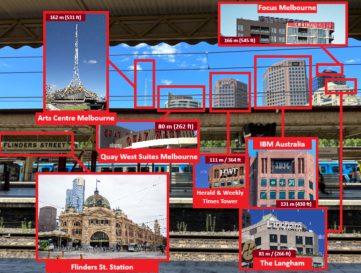
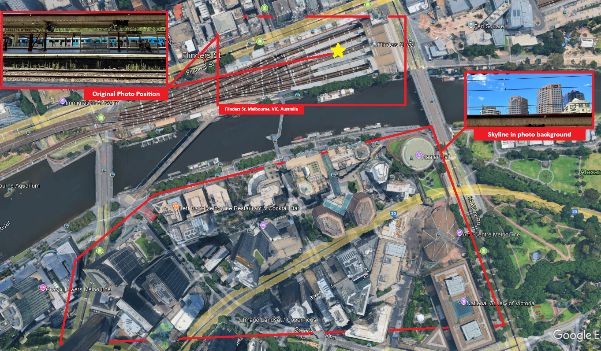
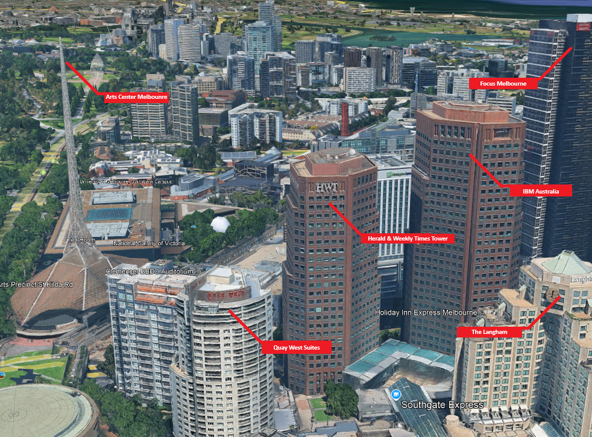
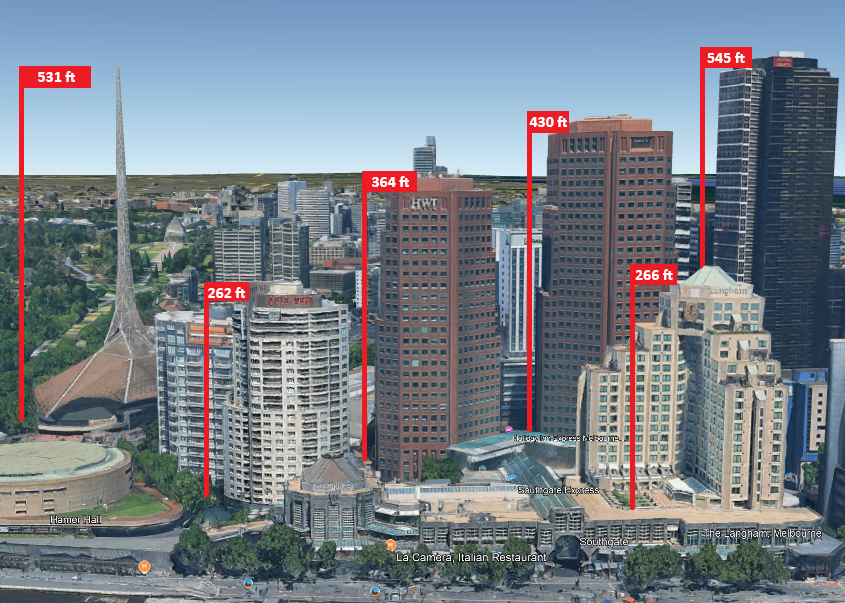
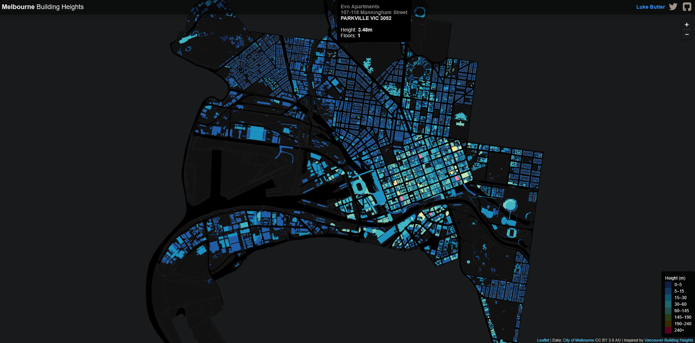
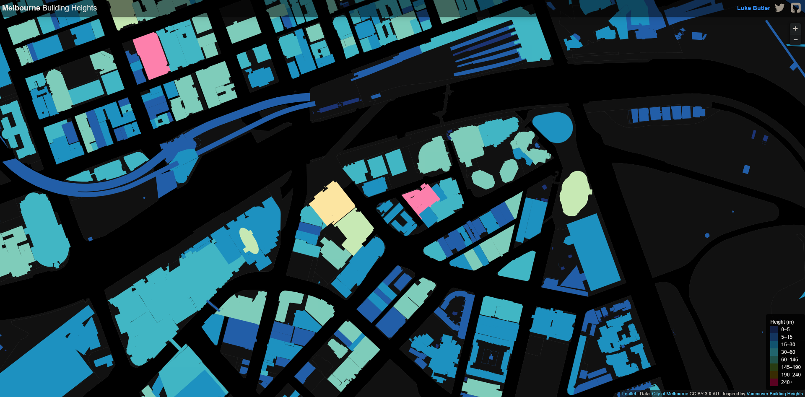
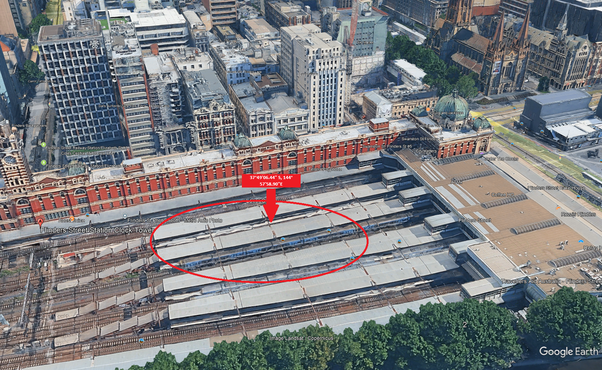

# (OSINT EX 002)Investigation-MAIN

**Task briefing:**
The photo below was shared on social media. It clearly depicts a train station.
Please answer the following questions:

*a) What is the name of the train station seen in the photo?
b) What is the name and height of the tallest structure seen in the photo?*

**Exercise level:**
*For beginners: a) Easy, b) Hard
For experts: a) Easy, b) Medium*

***

## Image Analysis

Using the visible train station sign of 'Flinders St.' you can confidently say this is a train station or a train stop at the very least.

Using google maps, the Flinder St. Station in Melbourne, Victoria, Australia. Surrounding buildings and skyline corroborate the findings. A dense urban enviroment like this will have lots of data points and vectors for investigation. First we find the exact spot of the original photo.

***

| Building Name               | Height (ft) | Height (m) |
| --------------------------- | ----------- | ---------- |
| Quay West Suites            | 262         | 80         |
| Arts Centre Melbourne       | 531         | 162        |
| The Langham                 | 266         | 81         |
| IBM Australia               | 430         | 131        |
| Focus Melbourne             | 545         | 166        |
| Herald & Weekly Times Tower | 364         | 111        |

To assertain the height of all visible structures in the skyline we used the following sources:

* https://en.wikipedia.org/wiki/List\_of\_tallest\_buildings\_in\_Melbourne
* https://lbutler.github.io/MelbBuildingHeights/

* https://www.skyscrapercenter.com/

***

37°49'06.44" S, 144°57'58.90"E

Tallest Building in the picture is: Focus Melbourne
