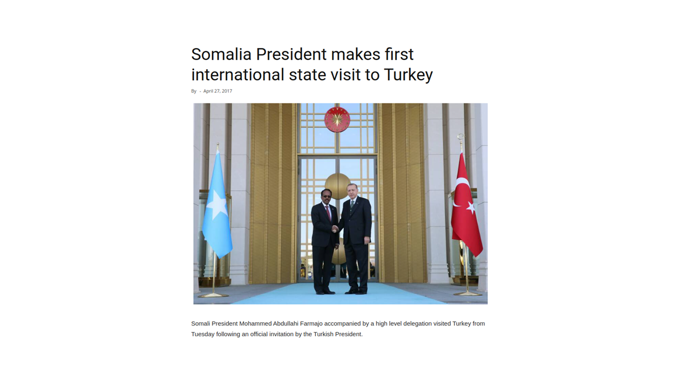
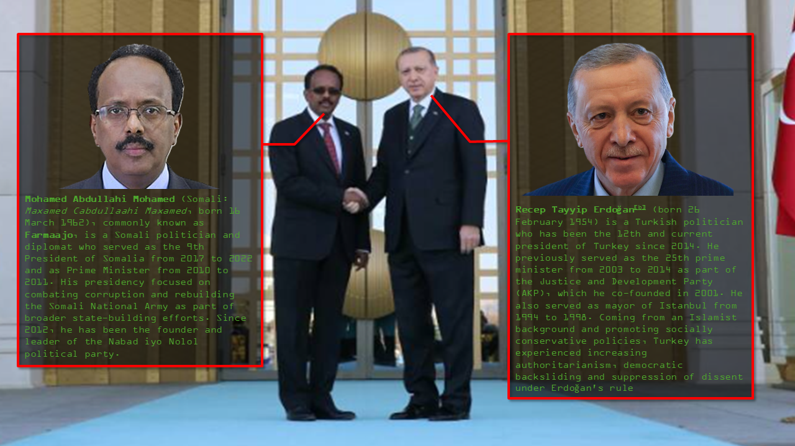
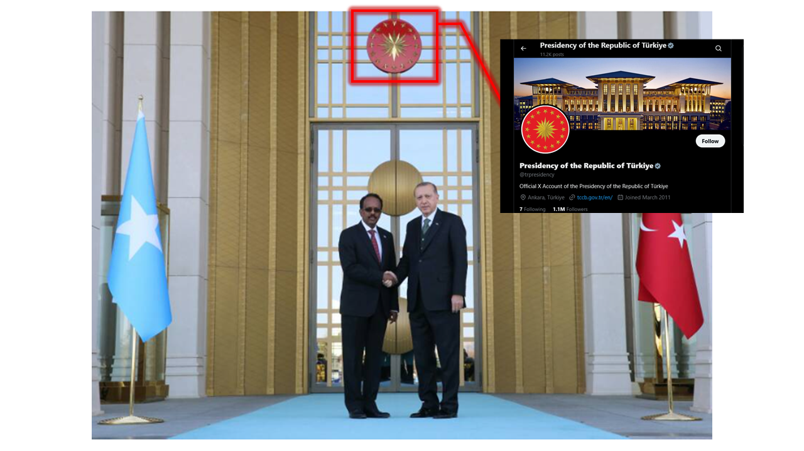
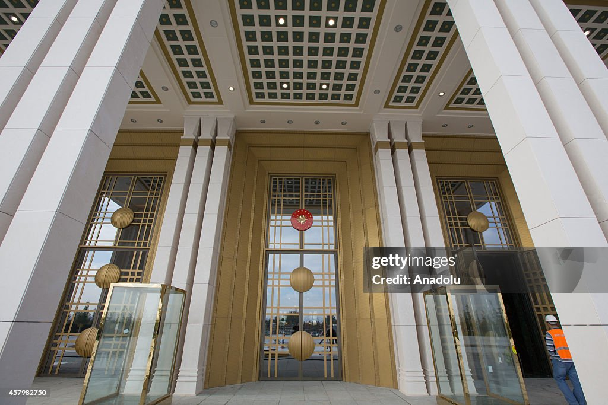
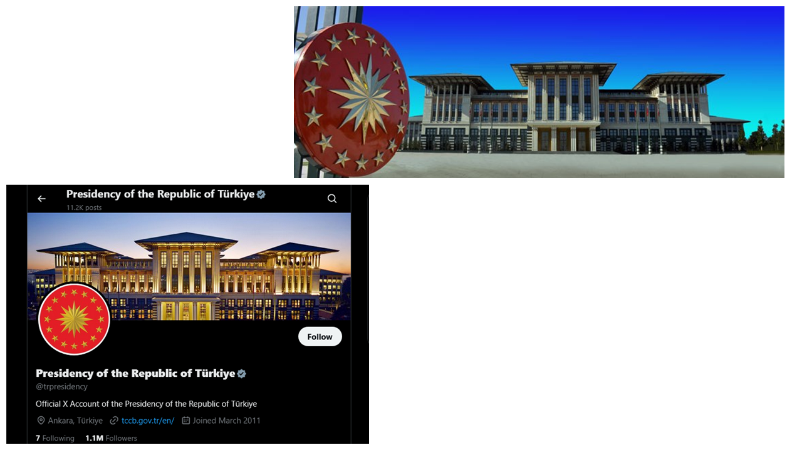
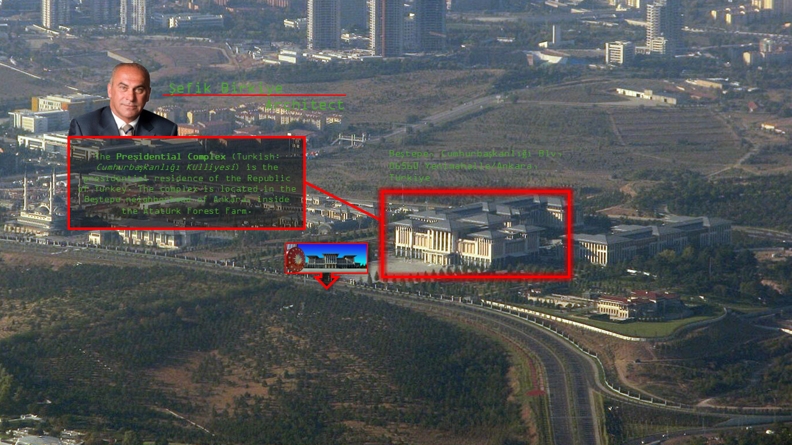
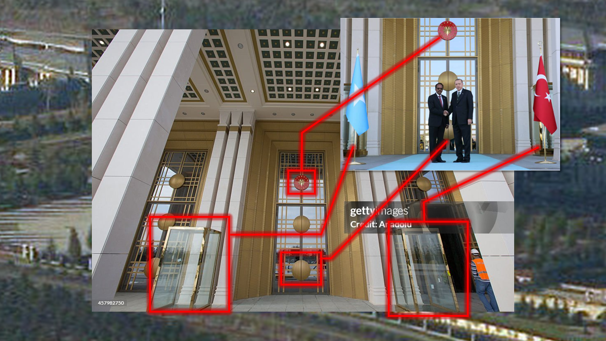
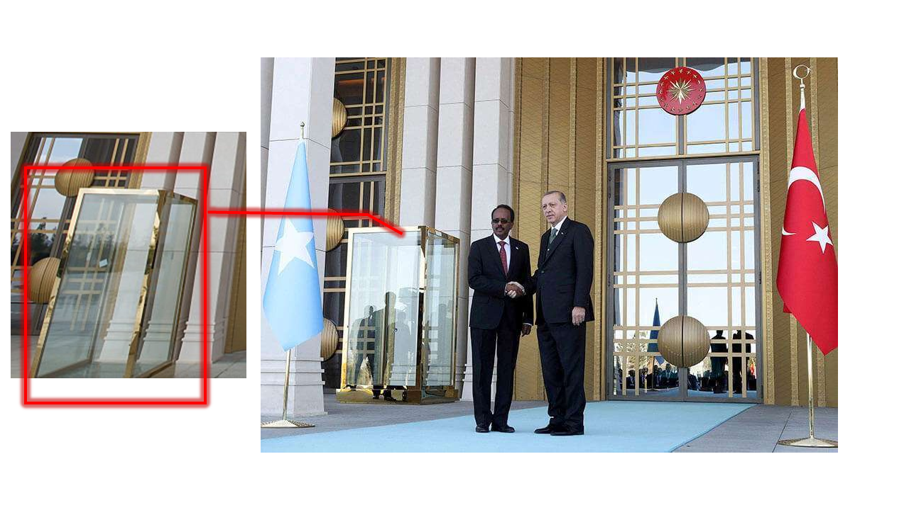
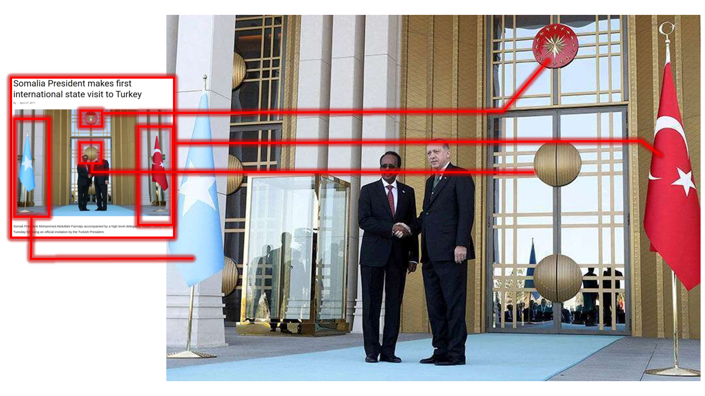

# (OSINT EX 003) Investigation

First we want to identify the relationship of both the people in the photo provided.

With the original photo we get flags, that would be transitiory due to the possibilty of this being an event space. Using the most identifable object in the video we can cross refence the above door symbol using image search to find the best possible match. Due to the fact we got a great match and corroboration with the setting and people in the photo would suggest that this and the builinding in the twitter header would be this exact building.

More corroboration showing the symbol on the building in question.

The building in the original image would appear with great confidence to be in the Turkish Presidential Complex.

Searching public photos for said presidential complex would confirm the exact location of the meeting in the original photo.

